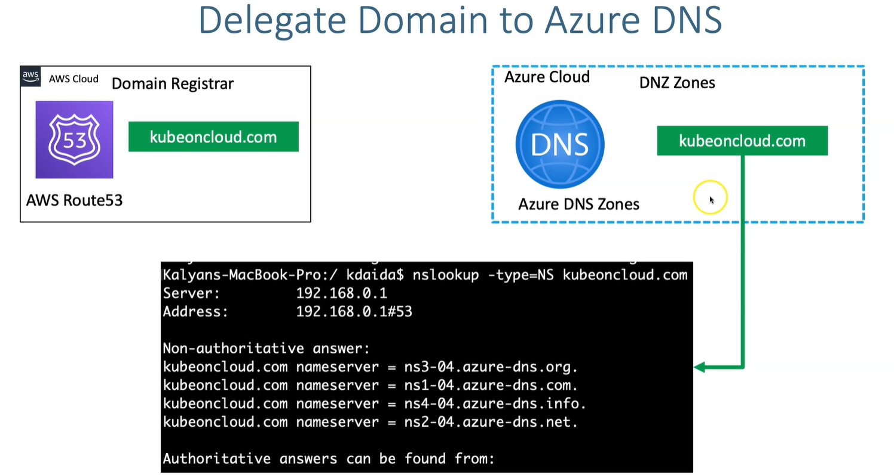

# Azure DNS
- It does not support domain registration




## devopseasylearning.net aws NS
```
ns-1789.awsdns-31.co.uk.
ns-1101.awsdns-09.org.
ns-313.awsdns-39.com.
ns-930.awsdns-52.net.
```

## Update Nameservers at your Domain 
- **Verify before updation**
```
nslookup -type=SOA devopseasylearning.net
nslookup -type=NS devopseasylearning.net
```

- **Verify after updation**
```
nslookup -type=SOA devopseasylearning.net 8.8.8.8
nslookup -type=NS devopseasylearning.net 8.8.8.8
```
PS: it can to 30 minutues to 1h for the SOA to point to Azure


